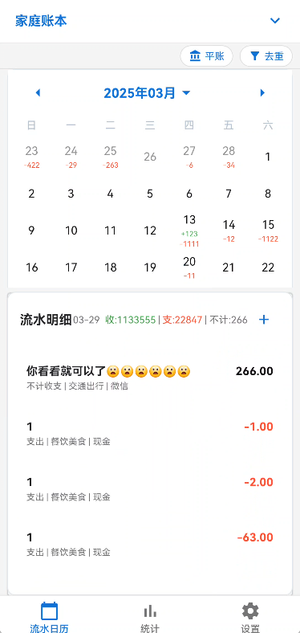
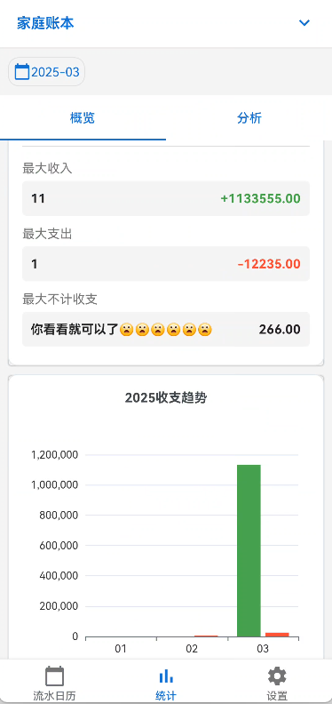
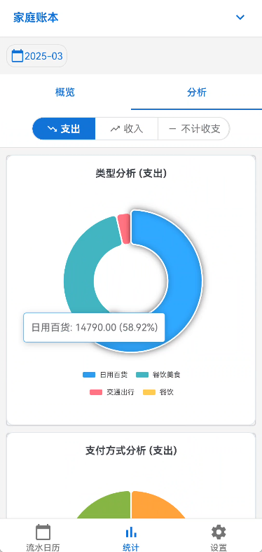
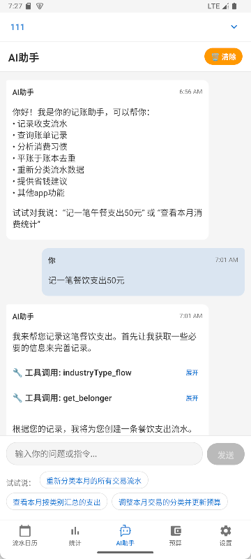
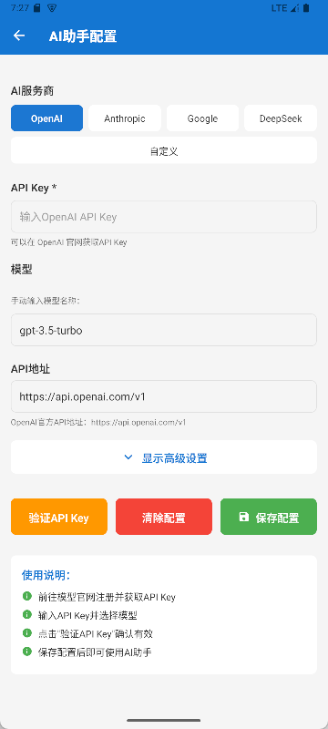

<h1>Cashbook App</h1>

  
  
  

  
  
  

  
  
  

Cashbook App 是 [Cashbook](https://github.com/dingdangdog/cashbook) 的移动客户端，提供便捷的记账体验，随时随地管理您的财务。

## ✨ 功能特点
已支持功能
- 📱 跨平台支持 (~~iOS~~ & Android)
  - IOS版本暂无,欢迎PR
- 📊 流水日历视图，直观展示每日收支
- 📈 统计分析，了解您的消费习惯
- 🔄 自动去重功能，避免重复记账
- ⚖️ 平账功能，轻松处理退款和转账
- 📚 多账本管理，分类整理不同用途的账目
- 🔐 安全连接到您的 Cashbook 服务器
- 📊 预算管理,设定预算，实时监控支出进度
- 🤖 AI助手功能，智能财务管理
  - 智能记账建议：根据消费习惯提供记账建议,APP功能自动处理简化记账操作
  - 财务分析：分析消费模式，提供优化建议
  - 预算规划：帮助制定合理的预算计划
  - 问答交互：回答关于财务管理的各种问题
  - 支持多种AI模型：OpenAI、DeepSeek等
- 🧾 小票管理,拍照或上传小票
  - 小票记账,拍摄小票图片识别手动记账或者ai自动记账

## 🤖 AI助手功能

### 如何使用AI助手
1. **启用AI助手**：
   - 进入App的“设置”页面
   - 找到“AI助手功能”开关，将其打开
   - 首次启用时会显示风险提示，请仔细阅读后确认启用

2. **配置AI参数**：
   - 启用后，设置页面会出现“AI助手配置”选项
   - 点击进入配置页面，可以设置：
     - API密钥（支持OpenAI、DeepSeek等多种模型）
     - 选择AI模型
     - 调整其他相关参数

3. **开始使用**：
   - 配置完成后，主界面底部导航栏会出现“AI助手”标签页
   - 点击进入AI助手聊天界面，即可开始对话

### 使用注意事项
⚠️ **重要提示**：
1. **数据隐私**：AI助手需要访问您的账本数据以提供智能建议。部分数据可能会被发送到外部AI服务进行处理，请确保您了解相关风险。
2. **数据备份**：强烈建议在启用AI助手前，自行备份重要数据，或导出账本数据到安全位置。
3. **定期备份**：建议定期备份数据，以防意外情况发生。
4. **模型选择**：不同的AI模型在准确性和成本上有所差异，请根据自身需求选择合适的模型。
5. **API费用**：使用AI模型可能会产生API调用费用，请留意相关服务的收费标准。
6. **功能限制**：AI助手提供的建议仅供参考，不构成专业的财务建议。重要财务决策请咨询专业财务顾问。
   如果您对数据安全有较高要求，建议：
- 仅在必要时启用AI助手
- 使用后及时关闭功能
- 避免在AI助手中处理高度敏感的交易信息
### ⚙️ AI助手配置

#### 支持的AI服务商
AI助手支持多种AI服务商，您可以根据需求选择合适的服务：
- **OpenAI**：提供GPT系列模型，如GPT-3.5-turbo、GPT-4等
- **DeepSeek**：提供DeepSeek系列模型，性价比高
- **其他兼容OpenAI API的服务**：支持任何兼容OpenAI API格式的第三方服务

#### 需要配置的参数
在AI助手配置页面中，您需要设置以下参数：

1. **API密钥**：
   - 从您选择的AI服务商处获取API密钥
   - 确保密钥具有足够的权限调用相应模型

2. **模型选择**：
   - 根据您的需求选择合适的模型
   - 不同模型在性能、速度和成本上有所差异
   - 模型要求：
     - 主模型: 需支持FunctionCall
     - 建议模型: 任何LLM
     - OCR模型: 需支持视觉理解
### 🆓 免费模型推荐

以下是一些可免费使用的AI模型，适合不同场景的财务管理需求：

#### 智谱AI (BigModel.cn)
**平台地址：** https://bigmodel.cn/

| 模型名称 | 类型 | 说明 |
|---------|------|------|
| GLM-4.7-Flash | 文本模型 | 高速文本生成，适合一般对话和财务分析 |
| GLM-4.6V-Flash | 视觉模型 | 支持图像理解，可用于小票识别 |
| GLM-4.1V-Thinking-Flash | 视觉模型 | 带思考能力的视觉模型，适合复杂图像分析 |
| GLM-4-Flash-250414 | 文本模型 | 轻量级文本模型，响应速度快 |
| GLM-4V-Flash | 视觉模型 | 通用视觉理解，支持多种图像任务 |
| Cogview-3-Flash | 图像生成 | 文本到图像生成模型 |
| CogVideoX-Flash | 视频生成 | 文本到视频生成模型 |

#### 硅基流动 (SiliconFlow.cn)
**平台地址：** https://www.siliconflow.cn/

| 模型名称 | 类型 | 说明 |
|---------|------|------|
| deepseek-ai/DeepSeek-R1-Distill-Qwen-7B | 文本模型 | 推理优化模型，适合逻辑分析和财务计算 |
| THUDM/GLM-4.1V-9B-Thinking | 视觉模型 | 9B参数的视觉思考模型，图像理解能力强 |
| PaddlePaddle/PaddleOCR-VL | OCR模型 | 专为OCR设计的视觉语言模型 |
| PaddlePaddle/PaddleOCR-VL-1.5 | OCR模型 | PaddleOCR的升级版本，识别精度更高 |
| deepseek-ai/DeepSeek-OCR | OCR模型 | DeepSeek专用的OCR识别模型 |
| Qwen/Qwen3-8B | 文本模型 | 通义千问8B参数版本，中文理解优秀 |
| tencent/Hunyuan-MT-7B | 文本模型 | 腾讯混元7B模型，多语言支持 |
| deepseek-ai/DeepSeek-R1-0528-Qwen3-8B | 文本模型 | DeepSeek推理模型，基于Qwen3-8B |
| THUDM/GLM-Z1-9B-0414 | 文本模型 | 智谱9B参数模型，通用对话能力强 |
| Qwen/Qwen2.5-7B-Instruct | 文本模型 | 指令优化版本，适合任务执行 |
| Qwen/Qwen2.5-Coder-7B-Instruct | 代码模型 | 编程专用，可用于财务公式计算 |
| THUDM/GLM-4-9B-0414 | 文本模型 | 智谱9B通用模型，平衡性能与速度 |
| internlm/internlm2_5-7b-chat | 文本模型 | 书生·浦语2.5的7B聊天版本 |
| THUDM/glm-4-9b-chat | 文本模型 | 智谱9B聊天优化版本 |
| Qwen/Qwen2-7B-Instruct | 文本模型 | 通义千问2代7B指令版本 |

#### 使用说明

1. **获取API密钥**：
   - 访问对应平台官网注册账号
   - 在个人中心或API管理页面创建API密钥
   - 部分平台可能需要实名认证才能使用免费额度

2. **配置方法**：
   - 在Cashbook App的AI助手配置页面选择"自定义"或对应平台
   - 输入获取的API密钥
   - 设置正确的API端点（通常平台会提供）
   - 选择对应的模型名称

3. **模型选择建议**：
   - **文本对话**：选择GLM-4.7-Flash、Qwen3-8B等文本模型
   - **小票识别**：选择GLM-4V-Flash、DeepSeek-OCR等视觉/OCR模型
   - **财务分析**：选择带"Thinking"或"R1"的推理增强模型

#### ⚠️ 注意事项

1. **免费额度限制**：
   - 大多数免费模型有每日或每月调用次数限制
   - 超出限制后可能需要付费或等待重置
   - 建议查看各平台最新的免费政策

2. **服务稳定性**：
   - 免费服务可能在高负载时响应变慢
   - 部分模型可能有并发请求限制
   - 重要操作建议使用付费服务保证稳定性

3. **数据隐私**：
   - 使用第三方AI服务时，部分数据会发送到外部服务器
   - 避免上传包含敏感个人信息的图像或文本
   - 定期检查各平台的隐私政策

4. **模型更新**：
   - 免费模型列表可能随平台政策变化
   - 建议定期访问平台官网获取最新信息
   - 部分模型可能停止服务或转为付费

> 提示：不同模型在功能、速度和准确性上有所差异，建议根据实际需求测试多个模型以找到最适合的选项。

4. **温度参数**：
   - 控制AI回答的随机性和创造性
   - 范围：0.0 到 2.0
   - 建议值：
     - 精确回答：0.1-0.3
     - 平衡模式：0.7-0.9

5. **系统提示词**：
   - 定义AI助手的角色和行为
   - 默认提示词已针对财务管理优化

## 📱 连接到 Cashbook 服务器

1. 启动应用后，进入服务器配置页面
2. 输入您的 Cashbook 服务器地址
3. 使用您的 Cashbook 账户登录
4. 开始使用所有功能！

## 🔧 配置

### 服务器配置

应用支持连接到任何运行 [Cashbook](https://github.com/dingdangdog/cashbook) 的服务器实例。您可以：

- 添加多个服务器配置
- 设置默认服务器
- 在不同服务器之间切换

### 账本管理

- 创建多个账本
- 设置默认账本
- 自定义账本属性

## 🤝 贡献

我们欢迎所有形式的贡献！请遵循以下流程：
1. Fork 本仓库
2. 创建 feature 分支 (`git checkout -b feature/AmazingFeature`)
3. 提交修改 (`git commit -m 'Add some AmazingFeature'`)
4. 推送分支 (`git push origin feature/AmazingFeature`)
5. 发起 Pull Request
## 📄 许可证

本项目采用 MIT 许可证 - 详情请参阅 [LICENSE](LICENSE) 文件。

## 🔗 相关链接

- [Cashbook 服务端](https://github.com/dingdangdog/cashbook)
- [问题反馈](https://github.com/houxiaoyi0722/cashbook_app/issues)

## 📸 截图

### 🤖 AI助手功能截图

---

*Cashbook App - 让记账更简单，财务管理更轻松！*
